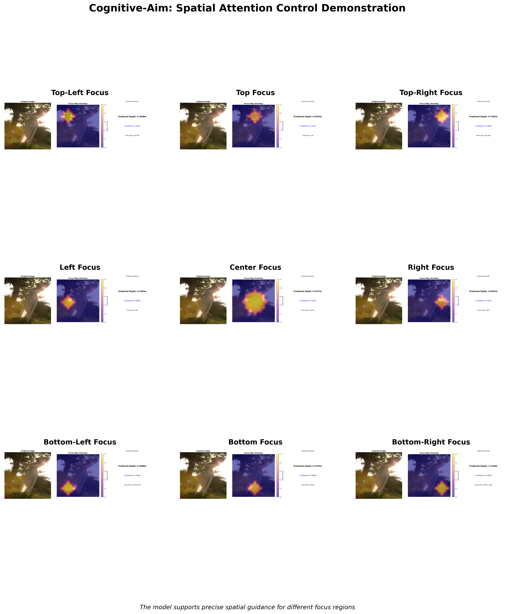

# Cognitive-Aim Depth Estimation Model

Monocular depth estimation model based on cognitive attention mechanism with guided inference support.

## Quick Start

### 1. Download Pre-trained Model

Download the pre-trained model file `cognitive_aim_model.pth` (568MB):

**Download Link:**
- **Hugging Face:** [cognitive_aim_model.pth](https://huggingface.co/yenjane123/cognitive_aim1.0/tree/main)

Place the downloaded file in the `checkpoints/` directory:
```
checkpoints/
├── README.md
└── cognitive_aim_model.pth
```

### 2. Install Dependencies and Run

```bash
# Install dependencies
pip install -r requirements.txt

# Single image inference
python demo.py --image 1.jpg --instruction center

# Train model
python train.py --config configs/experiment_B.yaml
```

## Directory Structure

```
repro_expB/
├── README.md           # Documentation
├── requirements.txt    # Dependencies
├── configs/
│   └── experiment_B.yaml  # Main configuration
├── eval_configs/       # Ablation study configs
│   ├── baseline_dinov2_config.yaml
│   ├── full_cognitive_config.yaml
│   ├── without_ambient_config.yaml
│   ├── without_exif_config.yaml
│   └── ...
├── src/                # Core code
│   ├── model.py       # Model implementation
│   ├── dataset.py     # Data processing
│   └── utils.py       # Utility functions
├── demo.py            # Inference script
├── train.py           # Training script
├── checkpoints/       # Model weights
└── demo_results/      # Inference results
```

## Usage

### Inference

```bash
# Basic inference
python demo.py --image 1.jpg

# Guided inference (supports 9 instructions)
python demo.py --image 2.jpg --instruction center
python demo.py --image 2.jpg --instruction left
python demo.py --image 2.jpg --instruction top-left
```

**Supported guidance instructions:**
- `center` - Center focus
- `left`, `right`, `top`, `bottom` - Directional focus
- `top-left`, `top-right`, `bottom-left`, `bottom-right` - Corner focus

### Training

```bash
# Train with default configuration
python train.py --config configs/experiment_B.yaml

# Custom parameters
python train.py --config configs/experiment_B.yaml --epochs 100 --batch-size 8
```

### Ablation Studies

```bash
# Full cognitive model
python train.py --config eval_configs/full_cognitive_config.yaml

# Baseline model (DINOv2)
python train.py --config eval_configs/baseline_dinov2_config.yaml

# Without ambient stream
python train.py --config eval_configs/without_ambient_config.yaml

# Without EXIF prior
python train.py --config eval_configs/without_exif_config.yaml
```

## Visual Results

### Spatial Guidance Effects

The model supports 9 different spatial guidance instructions, demonstrating focused attention on different regions:



*Figure: Nine-grid spatial guidance effects showing how different instructions (top-left, top, top-right, left, center, right, bottom-left, bottom, bottom-right) guide the model's attention to specific regions of the image.*

## Core Features

- **Cognitive Modules**: Ambient stream + Iterative focal stream + EXIF prior database
- **Guided Inference**: 9 spatial attention guidance modes
- **EXIF Processing**: Automatic extraction of camera parameters (focal length, aperture, ISO, etc.)
- **Heatmap Visualization**: Display model attention distribution

## Requirements

- Python >= 3.8
- PyTorch >= 1.12.0
- OpenCV, PIL, NumPy

See `requirements.txt` for details

## Output Format

Inference results include:
- Depth prediction values
- Confidence scores
- Attention heatmaps
- EXIF metadata

## License

MIT License